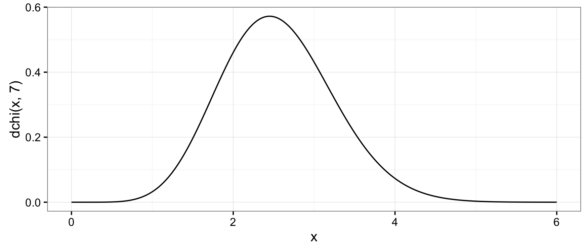
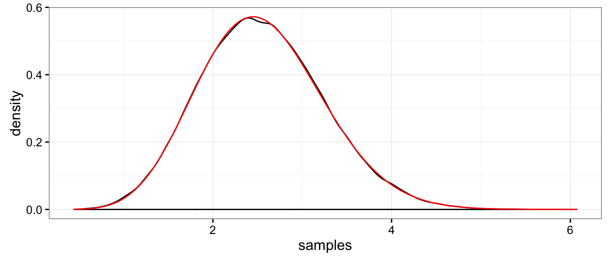

<!-- README.md is generated from README.Rmd. Please edit that file -->
**invgamma**
============

**invgamma** implements the `(d/p/q/r)` statistics functions for the [chi distribution](https://en.wikipedia.org/wiki/Chi_distribution) in [R](http://cran.r-project.org). It is ideal for using in other packages since it is lightweight and leverages the `(d/p/q/r)chisq()` line of functions maintained by CRAN.

### Getting **chi**

<!-- There are two ways to get __chi__.  For the [CRAN version](https://cran.r-project.org/package=chi), use -->
<!-- ```{r, eval=FALSE} -->
<!-- install.packages("chi") -->
<!-- ``` -->
For the development version, use

``` r
# install.packages("devtools")
devtools::install_github("dkahle/chi")
```

### The `(d/p/q/r)chi()` functions

The defining property of the chi distribution is that it is the square root of a chi random variable.

The [PDF](https://en.wikipedia.org/wiki/Probability_density_function) (the *f(x)*) can be evaluated with the `dchi()` function:

``` r
library(chi)
library(ggplot2); theme_set(theme_bw())
x <- seq(0, 6, .01)
qplot(x, dchi(x, 7), geom = "line")
```



The [CDF](https://en.wikipedia.org/wiki/Cumulative_distribution_function) can be evaluated with the `pinvgamma()` function:

``` r
f <- function(x) dchi(x, 7)
q <- 2
integrate(f, 0, q)
#  0.2202226 with absolute error < 2.4e-15
(p <- pchi(q, 7))
#  [1] 0.2202226
```

The [quantile function](https://en.wikipedia.org/wiki/Quantile_function) can be evaluated with `qchi()`:

``` r
qchi(p, 7) # = q
#  [1] 2
```

And random number generation can be performed with `rchi()`:

``` r
set.seed(1)
rchi(5, 7)
#  [1] 2.006520 3.389800 3.349233 2.742686 3.907928
```

`rchi()` can be used to obtain a [Monte Carlo](https://en.wikipedia.org/wiki/Monte_Carlo_method) estimate of the probability given by `pchi()` above:

``` r
samples <- rchi(1e5, 7)
mean(samples <= q)
#  [1] 0.22172
```

Moreover, we can check the consistency and correctness of the implementation with

``` r
qplot(samples, geom = "density") + 
  stat_function(fun = f,  color = "red")
```


